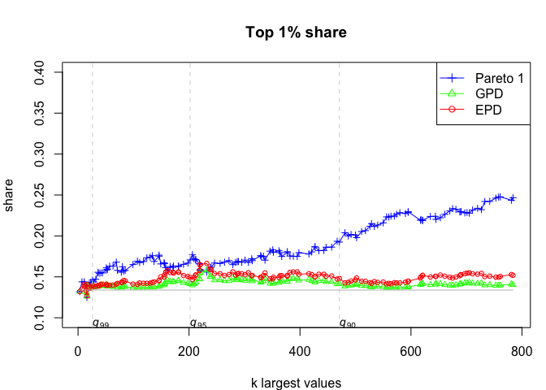

Pareto models for top-incomes
================
Arthur Charpentier & Emmanuel Flachaire


# Install the `TopIncome` library

``` r
library(devtools)
devtools::install_github("freakonometrics/TopIncome")
```

    ## Skipping install of 'TopIncome' from a github remote, the SHA1 (2af9086f) has not changed since last install.
    ##   Use `force = TRUE` to force installation

``` r
library(TopIncome)
```

# Fitting Pareto Models

``` r
n <- 1000
set.seed(123)
x <- repd(n,.5,1,-1)
w <- rgamma(n,10,10)
```

## Pareto 1

``` r
estim <- MLE.pareto1(data=x, weights=w, threshold=1)
estim
```

    ## $alpha
    ## [1] 3.300653
    ## 
    ## $k
    ## [1] 1000

## Generalized Pareto

``` r
estim <- MLE.gpd(data=x, weights=w, threshold=1)
estim$par.ests
```

    ##        xi      beta 
    ## 0.4892361 0.2488107

## Extended Pareto

``` r
EPD(data=x, weights=w)
```

    ## $k
    ## [1] 999
    ## 
    ## $gamma
    ## [1] 0.3737252
    ## 
    ## $kappa
    ## [1] 0.1628108
    ## 
    ## $tau
    ## [1] -3.342535

# Application to Income

``` r
pays="za"           # choix du pays South-Africa 2012 (za) or USA 2013 (us)
useweights=1        # estimation avec poids (1) ou sans poids (0)
epd.direct="TRUE"   # methode EPD: indirect (FALSE) or direct (TRUE) method

  df <- read.table("Ineq-pareto/appli/data/LIS/za12.LIS.txt",header=TRUE)
  PDxlim=c(9,14.2)
  ysup=5
  top.x=.25 ; top.y=.4
  top.xx=38 ; top.yy=.11

data_za = tidy_income(income = df$y, weights = df$w)
Pareto_diagram(data_za)
```

<!-- -->

``` r
Table_Top_Share(data_za)
```

    ## ----- index ----------
    ##           index1    index2    index3
    ## cutoff 0.9000000 0.9500000 0.9900000
    ##        0.1924827 0.1706478 0.1461168
    ## xi     0.1417580 0.1413610 0.1393819
    ##        0.1479852 0.1494570 0.1394055
    ## ----- alpha ----------
    ##          alpha1   alpha2    alpha3
    ## cutoff 0.900000 0.950000  0.990000
    ##        1.741886 1.880571  2.492415
    ## xi     2.689336 2.934580 19.248707
    ##        2.236125 2.254958  4.198110
    ## ----- top share ------
    ## $index
    ## [1] 0.1338787
    ## 
    ## $share
    ## [1] 0.01
    ## 
    ## $method
    ## [1] "edf"

    ## $index
    ## [1] 0.1338787
    ## 
    ## $share
    ## [1] 0.01
    ## 
    ## $method
    ## [1] "edf"

``` r
Top_Income(data_za)
```

    ## Warning in if (tail) {: the condition has length > 1 and only the first
    ## element will be used

<!-- -->
