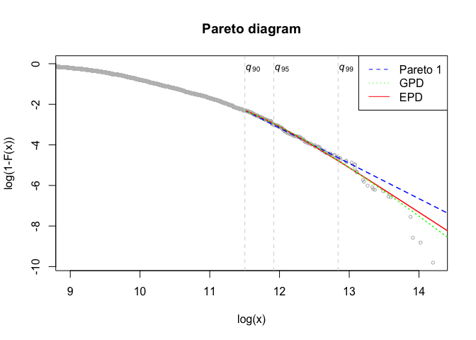
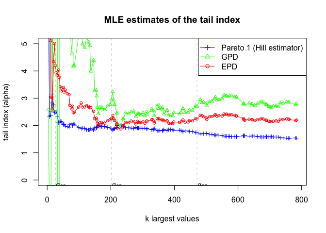
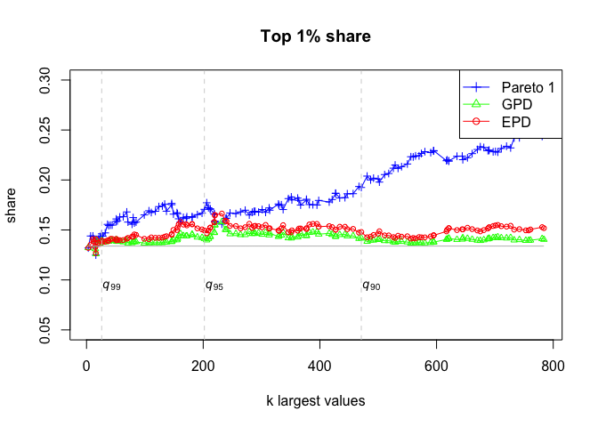

Pareto models for top-incomes
================
Arthur Charpentier & Emmanuel Flachaire

## Pareto (Pareto 1), with Weights

``` r
dpareto1 <- function (x, mu, alpha)  { alpha*mu^alpha/x^(alpha+1) }
ppareto1 <- function (x, mu, alpha)  { 1 - ( x/mu )^(-alpha) }
qpareto1 <- function (p, mu, alpha)  { mu*(1-p)^(-1/alpha) }
rpareto1 <- function (n, mu, alpha)  { mu*(1-runif(n))^(-1/alpha) }
```

``` r
MLE.pareto1 <- function(x,w=rep(1,length(x)),threshold=min(x))
{
  foo=cbind(x,w)
  foo=foo[foo[,1]>threshold,]
  xx=foo[,1]
  ww=foo[,2]/sum(foo[,2])
  m <- as.numeric(threshold)
#  n <- length(xx)
  a <- 1/(sum(ww*log(xx))-log(m))
  k <- NROW(xx)
  return(list(alpha=a,k=k))
}
```

## Generalized Pareto Distribution (GPD), with Weights

Modified `gpd` function from the `evir` R package to get weighted MLE
estimation of GPD (from original R code library `evir`, version 1.7.3)

``` r
pgpd <- function (q, xi, mu = 0, beta = 1)  { (1 - (1+(xi*(q-mu))/beta)^(-1/xi)) }
dgpd <- function (x, xi, mu = 0, beta = 1)  { (beta^(-1))*(1+(xi*(x-mu))/beta)^((-1/xi)-1) }
rgpd <- function (n, xi, mu = 0, beta = 1)  { mu + (beta/xi)*((1-runif(n))^(-xi)-1) }
```

``` r
MLE.gpd <- function (data, weights=rep(1,length(x)), threshold = NA, nextremes = NA, method="ml", information = c("observed", "expected"), ...) 
{
  n <- length(data)
  if (is.na(nextremes) && is.na(threshold)) 
    stop("Enter either a threshold or the number of upper extremes")
  if (!is.na(nextremes) && !is.na(threshold)) 
    stop("Enter EITHER a threshold or the number of upper extremes")
  if (!is.na(nextremes)) 
    
    data <- as.numeric(data)
  
  foo=cbind(data,weights)
  foo=foo[foo[,1]>threshold,]
  x=foo[,1]
  w=foo[,2]/sum(foo[,2])
  
  #    threshold <- findthresh(data, nextremes)
  #  exceedances <- data[data > threshold]
  exceedances <- x
  excess <- exceedances - threshold
  Nu <- length(excess)
  #  xbar <- mean(excess)
  xbar <- sum(w*excess)
  #  method <- match.arg(method)
  method <- "ml"
  #  if (method == "ml") {
  #    s2 <- var(excess)
  s2 <- sum(w*(excess-xbar)^2)
  xi0 <- -0.5 * (((xbar * xbar)/s2) - 1)
  beta0 <- 0.5 * xbar * (((xbar * xbar)/s2) + 1)
  theta <- c(xi0, beta0)
  negloglik <- function(theta, tmp) {
    xi <- theta[1]
    beta <- theta[2]
    cond1 <- beta <= 0
    cond2 <- (xi <= 0) && (max(tmp) > (-beta/xi))
    if (cond1 || cond2) 
      f <- 1e+06
    else {
      y <- logb(1 + (xi * tmp)/beta)
      y <- w*y/xi
      #        f <- length(tmp) * logb(beta) + (1 + xi) * sum(y)
      f <- logb(beta) + (1 + xi) * sum(y)
    }
    f
  }
  fit <- optim(theta, negloglik, hessian = TRUE, ..., tmp = excess)
  if (fit$convergence) 
    warning("optimization may not have succeeded")
  par.ests <- fit$par
  converged <- fit$convergence
  nllh.final <- fit$value
  #  }
  #  out <- list(n = length(data), data = exceedances, threshold = threshold, 
  #              p.less.thresh = p.less.thresh, n.exceed = Nu, method = method, 
  #              par.ests = par.ests, par.ses = par.ses, varcov = varcov, 
  #              information = information, converged = converged, nllh.final = nllh.final)
  p.less.thresh <- 1 - Nu/n
  out <- list(n = length(data), threshold = threshold, 
              p.less.thresh = p.less.thresh, n.exceed = Nu, k= Nu, method = method, 
              par.ests = par.ests, converged = converged, nllh.final = nllh.final)
  #    out <- list(alpha=1/par.ests[1], sigma=par.ests[2]/par.ests[1], par=par.ests, k=k)
  names(out$par.ests) <- c("xi", "beta")
  #  names(out$par.ses) <- c("xi", "beta")
  #  class(out) <- "gpd"
  #  out
  return(out)
  
}
```

## Extended Pareto Distribution (GPD), with Weights

Modified EPD function from the ReIns R package to have weighted ML
estimation, results from only one cutoff and direct ML estimation by
default (original R code from the `ReIns` package version 1.0.7, see
[EPD.R](https://github.com/TReynkens/ReIns/blob/master/R/EPD.R) and
[Distributions.R](https://github.com/TReynkens/ReIns/blob/master/R/Distributions.R))

Check input for EPD distribution

``` r
.EPDinput <- function(y, gamma, kappa, tau, kappaTau = TRUE) {
  
  # Check if arguments are numeric
  if (!is.numeric(gamma)) {
    stop("gamma should be numeric.")
  }
  
  if (!is.numeric(kappa)) {
    stop("kappa should be numeric.")
  }
  
  if (!is.numeric(tau)) {
    stop("tau should be numeric.")
  }
  
  # Check if right sign
  if (any(tau >= 0)) {
    stop("tau should be strictly negative.")
  }
  
  if (any(gamma <= 0)) {
    stop("gamma should be strictly positive.")
  }
  
  if (kappaTau) {
    if (any(kappa <= pmax(-1, 1/tau))) {
      stop("kappa should be larger than max(-1,1/tau).")
    }
  }
  
  # Check if correct length
  ly <- length(y)
  lg <- length(gamma)
  lk <- length(kappa)
  lt <- length(tau)
  
  l <- c(ly, lg, lk, lt)
  
  # Indices of lengths larger than 1
  ind <- which(l > 1)
  
  if (length(ind) > 1) {
    # Check that lengths larger than 1 are equal
    if (!length(unique(l[ind])) == 1) {
      stop("All input arguments should have length 1 or equal length.")
    }
  }
}
```

Density of an extended Pareto distribution

``` r
depd <- function(x, gamma, kappa, tau = -1, log = FALSE) {
  
  # Check input
  .EPDinput(x, gamma, kappa, tau, kappaTau = TRUE)
  
  # Compute density
  d <- 1 / (gamma*x^(1/gamma+1)) * (1+kappa*(1-x^tau))^(-1/gamma-1) * 
    (1+kappa*(1-(1+tau)*x^tau))
  # Formula is not valid for values below 1
  d[x <= 1] <- 0
  
  if (log) d <- log(d)
  
  return(d)
}
```

Cumulative distribution function of an extended Pareto distribution

``` r
pepd <- function(x, gamma, kappa, tau = -1, lower.tail = TRUE, log.p = FALSE) {
  
  # Check input
  .EPDinput(x, gamma, kappa, tau, kappaTau = FALSE)
  
  # Compute probabilities
  p <- 1 - (x * (1+kappa*(1-x^tau)))^(-1/gamma) 
  # Formula is not valid for values below 1
  p[x <= 1] <- 0
  
  # Problems when condition not satisfied
  if (any(kappa <= pmax(-1, 1/tau))) {
    if (length(kappa) > 1 | length(tau) > 1) {
      p[kappa <= pmax(-1, 1/tau)] <- NA
    } else {
      p <- NA
    }
  }
  
  if (!lower.tail) p <- 1-p
  
  if (log.p) p <- log(p)
  
  return(p)
}
```

Quantile function of EPD

``` r
qepd <-  function(p, gamma, kappa, tau = -1, lower.tail = TRUE, log.p = FALSE) {
  
  # Check input
  .EPDinput(p, gamma, kappa, tau, kappaTau = TRUE)
  
  
  if (log.p) p <- exp(p)
  
  if (!lower.tail) p <- 1-p
  
  if (any(p < 0 | p > 1)) {
    stop("p should be between 0 and 1.")
  }
  
  # Compute quantiles numerically
  l <- length(p)
  Q <- numeric(l)
  
  # Take 10 as endpoint for interval to search over unless not large enough
  endpoint <- 10
  
  if (any(p < 1)) {
    
    mx <- max(p[p < 1])
    
    while (pepd(endpoint, gamma, kappa, tau) <= mx) {
      endpoint <- endpoint*10
    }
    
  }
  
  for (i in 1:l) {
    
    if (p[i] < .Machine$double.eps) {
      # p=0 case
      Q[i] <- 1
      
    } else if (abs(p[i]-1) > .Machine$double.eps) {
      # 0<p<1 case
      
      # Function to minimise
      f <- function(x) {
        ((1-p[i])^(-gamma) - x*(1+kappa*(1-x^tau)))^2
      }
      # If minimising fails return NA
      Q[i] <- tryCatch(optimise(f, lower=1, upper=endpoint)$minimum, error=function(e) NA) 
      
    } else {
      # p=1 case
      Q[i] <- Inf
    }
    
  }
  
  return(Q)
}
```

Random number generation for EPD

``` r
repd <-  function(n, gamma, kappa, tau = -1) {
  return(qepd(runif(n), gamma=gamma, kappa=kappa, tau=tau))
}
```

# Estimation

``` r
Hill = function(data,w=rep(1,length(data))){
    w <- w/sum(w)
    n <- length(data)
    X <- as.numeric(sort(data))
    Hill <- sum(w[2:n]*(log(X[2:n])-log(X[1])))
    return(list(gamma = Hill))
}
```

``` r
EPD <- function(data, w=rep(1,length(data)), rho = -1, start = NULL, direct = TRUE, warnings = FALSE,
logk = FALSE, plot = FALSE, add = FALSE, main = "EPD estimates of the EVI", ...) {
# browser() 
# permet de suivre pas a pas l'appel de la fonction 

#    w <- w/sum(w)
#    X <- as.numeric(sort(data))
    
    df=data.frame(data,w)
    df=df[order(df$data),]
    w <- df$w/sum(df$w)
    X <- as.numeric(df$data)
    n <- length(X)
    K <- (n-1)
    
    if (n == 1) {
        stop("We need at least two data points.")
    }
    
    if (direct) {
        # Select parameters by minimising MLE
        EPD <- .EPDdirectMLE(data=data, w=w, rho=rho, start=start, warnings=warnings)
    } else {
        # Select parameter using approach of Beirlant, Joosens and Segers (2009). 
        EPD <- .EPDredMLE(data=data, w=w, rho=rho)
    }
    
    
    # Transform to vectors if rho is a single value
    if (length(rho) == 1) {
        EPD$gamma <- as.vector(EPD$gamma)
        EPD$kappa <- as.vector(EPD$kappa)
        EPD$tau <- as.vector(EPD$tau)
        
    }
    
    if (length(rho) == 1) {
        return(list(k=K, gamma=EPD$gamma[K], kappa=EPD$kappa[K], tau=EPD$tau[K]))
    } else {
        return(list(k=K, gamma=EPD$gamma[K,], kappa=EPD$kappa[K,], tau=EPD$tau[K,]))
    }
}
```

Fit EPD using approach of Beirlant, Joosens and Segers (2009)

``` r
.EPDredMLE <- function(data, w=rep(1,length(data)), rho = -1) {
  
#    w <- w/sum(w)
#    X <- as.numeric(sort(data))
  
    df=data.frame(data,w)
    df=df[order(df$data),]
    w <- df$w/sum(df$w)
    X <- as.numeric(df$data)

    n <- length(X)
    K <- (n-1)
    
    if (n == 1) {
        stop("We need at least two data points.")
    }
    
    nrho <- length(rho)
    rho.orig <- rho
    
    H <- Hill(data, w)$gamma
    
    if (all(rho > 0) & nrho == 1) {
        rho <- .rhoEst(data, alpha=1, tau=rho, w=w)$rho
        beta <- -rho
        
    } else if (all(rho < 0)) {
        beta <- -rho
        
    } else {
        stop("rho should be a single positive number or a vector (of length >=1) of negative numbers.")
    }
    
    
    gamma <- matrix(0, n-1, nrho)
    kappa <- matrix(0, n-1, nrho)
    tau <- matrix(0, n-1, nrho)
    
    beta <- -rho
    
    for (j in 1:nrho) {
        
        # tau
        if (nrho == 1 & all(rho.orig > 0)) {
            # Estimates for rho of Fraga Alves et al. (2003) used 
            # and hence a different value of beta for each k
            tau[K, 1] <- -beta[K]/H
            
            # rho differs with k
            rhovec <- rho
        } else {
            # rho is provided => beta is constant over k
            # (but differs with rho)
            tau[K, j] <- -beta[j]/H
            
            # rho is constant over k
            rhovec <- rep(rho[j], n-1)
        }
        
        # kappa
        E <- numeric(n-1)
        
        for (k in K) {
            i <- 1:k
#            E[k] <- 1/k * sum( (X[n-k+i]/X[n-k])^tau[k,j] )
            E[k] <- sum( w[n-k+i] * (X[n-k+i]/X[n-k])^tau[k,j] )
        }
        
        kappa[K,j] <- H * (1-2*rhovec[K]) * (1-rhovec[K])^3 / rhovec[K]^4 * (E[K] - 1 / (1-rhovec[K]))
        
        
        # gamma
        gamma[K,j] <- H - kappa[K,j] * rhovec[K] / (1 - rhovec[K])
        
    }
    
    return(list(gamma=gamma, kappa=kappa, tau=tau))
}
```

Fit EPD by minimising MLE

``` r
.EPDdirectMLE <- function(data, w=rep(1,length(data)), rho = -1, start = NULL,  warnings = FALSE) {

#    w <- w/sum(w)
#    X <- as.numeric(sort(data))
#    n <- length(X)

    df=data.frame(data,w)
    df=df[order(df$data),]
    w <- df$w/sum(df$w)
    X <- as.numeric(df$data)
    n <- length(X)
    
    
    if (n == 1) {
        stop("We need at least two data points.")
    }
    
    nrho <- length(rho)
    rho.orig <- rho
    
    H <- Hill(data, w)$gamma     
    
    if (all(rho > 0) & nrho == 1) {
        rho <- .rhoEst(data, alpha=1, tau=rho, w=w)$rho
        beta <- -rho
        
    } else if (all(rho < 0)) {
        beta <- -rho
        
    } else {
        stop("rho should be a single positive number or a vector (of length >=1) of negative numbers.")
    }
    
    gamma <- matrix(0, n-1, nrho)
    kappa <- matrix(0, n-1, nrho)
    tau <- matrix(0, n-1, nrho)
    
    for (j in 1:nrho) {
        
        # Compute gamma and kappa for several values of k
#        for (k in (n-1):1) {                                 # @@@@@@@@@@@@
        for (k in (n-1):(n-1)) {

#            epddata <- data[data > X[n-k]]/X[n-k]

            epddf <- df[df$data > X[n-k],]
            epddata <- epddf$data/X[n-k]
            epdw    <- epddf$w
            
            # tau
            if (nrho == 1 & all(rho.orig > 0)) {
                # Estimates for rho of Fraga Alves et al. (2003) used 
                # and hence a different value of beta for each k
                tau[k,1] <- -beta[k]/H
                
            } else {
                # rho is provided => beta is constant over k
                # (but differs with rho)
                tau[k,j] <- -beta[j]/H
            }
            
            if (is.null(start)) {
                start2 <- numeric(2)
                start2[1] <- H
                start2[2] <- 0
            } else if (is.matrix(start)) {
                
                if (nrow(start >= n-1)) {
                    start2 <- numeric(2)
                    start2[1] <- start[k,1]
                    start2[2] <- start[k,2]
                } else {
                    stop("start does not contain enough rows.")
                }
                
            } else {
                start2 <- start
            }
            
            if (tau[k,j] < 0) {
                tmp <- EPDfit(epddata, start=start2, tau=tau[k,j], w=epdw)
                gamma[k,j] <- tmp[1]
                kappa[k,j] <- tmp[2]
            } else {
                # Problems if tau is >0
                gamma[k,j] <- kappa[k,j] <- NA
            }
            
        }
        
    }
    
    return(list(gamma=gamma, kappa=kappa, tau=tau))    # @@ rajout tau (manu)
}
```

Fit EPD to data using MLE, `start` is the starting value for
optimisation - `(gamma_start,kappa_start)`

``` r
EPDfit <- function(data, tau, start = c(0.1, 1), warnings = FALSE, w=rep(1,length(data))) {
    w <- w/sum(w)
    if (is.numeric(start) & length(start) == 2) {
        gamma_start <- start[1]
        kappa_start <- start[2]
    } else {
        stop("start should be a 2-dimensional numeric vector.")
    }
    
    
    if (ifelse(length(data) > 1, var(data) == 0, 0)) {
        sg <- c(NA, NA)
    } else {
        
        #Note that optim minimises a function so we use minus the log-likelihood function
        fit <- optim(par=c(gamma_start, kappa_start), fn=.EPDneglogL, Y=data, tau=tau, w=w)
        # fit = nlminb(start=c(gamma_start,log(sigma_start)),objective=neglogL, Y=data)
        sg <- fit$par
        
        if (fit$convergence > 0 & warnings) {
            warning("Optimisation did not complete succesfully.")
            if (!is.null(fit$message)) {
                print(fit$message)
            }
        }
    }
    return(sg)
}
```

Minus log-likelihood for a univariate sample `Y` of iid EPD random
variables

``` r
.EPDneglogL <- function(theta, Y, tau, w) {
    w <- w/sum(w)
    gamma <- theta[1]
    # Makes sure that sigma is positive
    kappa <- theta[2]
    
    if (kappa <= max(-1, 1/tau) | gamma <= 0) {
        logL <- -10^6
    } else {
        logL <- sum( w*log(depd(Y, gamma=gamma, kappa=kappa, tau=tau)) )
    }
    
    # minus log-likelihood for optimisation
    return(-logL)
}
```

Estimator for `rho` of [Fraga Alves, Gomes and de Haan
(2003)](https://www.emis.de/journals/PM/60f2/pm60f204.pdf)

``` r
.rhoEst <- function(data, alpha = 1, theta1 = 2, theta2 = 3, tau = 1, w=rep(1,length(data))) {
    
    
    if (alpha <= 0) {
        stop("alpha should be strictly positive.")
    }
    
    
    if (tau <= 0) {
        stop("tau should be strictly positive.")
    }
    
    
#    X <- as.numeric(sort(data))
#    w <- w/sum(w)
    
    df=data.frame(data,w)
    df=df[order(df$data),]
    w <- df$w/sum(df$w)
    X <- as.numeric(df$data)
    
    n <- length(X)
    rho <- numeric(n)
    Tn <- numeric(n)
    K <- (n-1)
    
    M_alpha <- numeric(n)
    M_alpha_theta1 <- numeric(n)
    M_alpha_theta2 <- numeric(n)
    
    l <- log(X[n-K+1])
    for (k in K) {
        M_alpha[k] <- sum( (l[1:k]-log(X[n-k]))^alpha ) / k
        M_alpha_theta1[k] <- sum( (l[1:k]-log(X[n-k]))^(alpha*theta1) ) / k
        M_alpha_theta2[k] <- sum( (l[1:k]-log(X[n-k]))^(alpha*theta2) ) / k
    }
    
    Tn[K] <- ( (M_alpha[K]/gamma(alpha+1))^tau - (M_alpha_theta1[K]/gamma(alpha*theta1+1))^(tau/theta1)  ) / 
    ( (M_alpha_theta1[K]/gamma(alpha*theta1+1))^(tau/theta1) - (M_alpha_theta2[K]/gamma(alpha*theta2+1))^(tau/theta2)  ) 
    
    rho[K] <- 1 - ( 2 * Tn[K] / ( 3 - Tn[K]) ) ^ (1/alpha)
    
    return(list(k=K, rho=rho[K], Tn=Tn[K]))
}
```

Probabilities and return periods

``` r
ProbEPD <- function(data, q, gamma, kappa, tau, plot = FALSE, add = FALSE,
main = "Estimates of small exceedance probability", ...) {
    
    
    if ( length(gamma) != length(kappa) | length(gamma) != length(tau)) {
        stop("gamma, kappa and tau should have equal length.")
    } 
    
    X <- as.numeric(sort(data))
    
    
    n <- length(X)
    prob <- numeric(n)
    K <- (n-1)
    
    K2 <- K[which(gamma[K] > 0)]
    
    prob[K2] <- (K2+1)/(n+1) * (1 - pepd(q/X[n-K2], gamma=gamma[K2], kappa=kappa[K2], tau=tau[K2]))
    prob[prob < 0 | prob > 1] <- NA
    
    
    # output list with values of k, corresponding return period estimates 
    # and the considered large quantile q
    
    return(list(k=K, P=prob[K], q=q))
    
}


ReturnEPD <- function(data, q, gamma, kappa, tau, plot = FALSE, add = FALSE, 
main = "Estimates of large return period", ...) {
    
    
    if ( length(gamma) != length(kappa) | length(gamma) != length(tau)) {
        stop("gamma, kappa and tau should have equal length.")
    } 
    
    X <- as.numeric(sort(data))
    n <- length(X)
    r <- numeric(n)
    K <- (n-1)
    K2 <- K[which(gamma[K] > 0)]
    r[K2] <- (n+1)/(K2+1) / (1 - pepd(q/X[n-K2], gamma=gamma[K2], kappa=kappa[K2], tau=tau[K2]))
    r[which(gamma[K] <= 0)] <- NA
    r[r <= 0] <- NA
    return(list(k=K, R=r[K], q=q))
}
```

# Top Shares

``` r
TopShare <- function(x, weights=rep(1,length(x)), p=.1, q=.1, method="edf", epd.direct=TRUE) {
  #
  # p : top 100p% share
  # q : top 100q% of the distribution being Pareto
  #
  # method="edf" : sample top share, that is, based on the EDF
  # method="pareto1" : EDF+Pareto1
  #
  
  if (p>1) stop('Error: p should be smaller than 1 \n\n') 
  if (p<0) stop('Error: p should be greater than 0 \n\n') 
  up=Hmisc::wtd.quantile(x, weights=weights, probs=1-p, normwt=TRUE) # weighted (1-p)-quantile
  up=as.numeric(up)
  
  ## Top Share based on the Empirical Distribution Function (EDF)
  
  if(method=="edf") {
    tis=sum(weights*x*(x>up))/sum(weights*x)
    return(list(index=tis,share=p,method="edf"))
  }
  
  ## Top Share based on Pareto I and GPD Models
  
  if (q>1) stop('Error: q should be smaller than 1 \n\n') 
  if (q<0) stop('Error: q should be greater than 0 \n\n') 
  
  
  u=Hmisc::wtd.quantile(x, weights=weights, probs=1-q, normwt=TRUE) 
  u=as.numeric(u)  # threshold = weighted (1-q)-quantile
  data=cbind(x,weights)
  dataq=data[x<u,]
  xq = Hmisc::wtd.mean(dataq[,1], weights=dataq[,2])
  
  if(method=="pareto1" || method=="pareto2" || method=="gpd") {
    # Estimate the Pareto distribution with weighted data
    if(method=="pareto1") {
      coef=MLE.pareto1(x,w=weights,threshold=u)
      sigma=u
      alpha=coef$alpha
    }
    if(method=="pareto2" || method=="gpd") {
      coef=MLE.gpd(x,w=weights,threshold=u)
      sigma=coef$par.ests["beta"]/coef$par.ests["xi"]
      alpha=1/coef$par.ests["xi"]
    }
    # Top Income Shares with weighted data
    if (alpha<1) { tis=NaN            
    } else if(p<=q) { 
      num = (alpha/(alpha-1))*sigma*(p/q)^(-1/alpha) + u - sigma
      den = (1-q)*xq + q*sigma/(alpha-1) + q*u
      tis = p*num/den
    } else if(p>q)  {
      up=Hmisc::wtd.quantile(x, weights=weights, probs=1-p, normwt=TRUE) 
      up=as.numeric(up)
      datap=data[x<up,]
      xp = Hmisc::wtd.mean(datap[,1], weights=datap[,2])
      den = (1-q)*xq + q*sigma/(alpha-1) + q*u
      tis = 1 - (1-p)*xp/den
    }
    return(list(index=tis,alpha=alpha,coef=coef,share.index=p,share.pareto=q,threshold=u))
  }
  
  ## Top Share based on EPD Model
  if(method=="epd") {
    
    dataqq=data[x>=u,]
    coef=EPD(dataqq[,1], w=dataqq[,2], direct=epd.direct)
    delta=coef$kappa
    tau=coef$tau
    alpha=1/coef$gamma
    
    up=Hmisc::wtd.quantile(x, weights=weights, probs=1-p, normwt=TRUE) 
    up=as.numeric(up)
    datap=data[x<up,]
    xp = Hmisc::wtd.mean(datap[,1], weights=datap[,2])
    
    pextpareto=function(x, u=1, delta=0, tau=-1, alpha){#Compute CDF
      d=1-((x/u)*(1+delta-delta*(x/u)^tau))^(-alpha)
      d[x<=u] <- 0
      return(d) }
    ff_bis <- function(x) (1-pextpareto(1/x, u=u, delta=delta, tau=tau, alpha=alpha))/x^2
    
    if (alpha<=1) {tis=NaN    # infinite mean (tail=alpha=1/xi < 1)
    } else if(delta<max(-1,1/tau)) {tis=NaN   # kappa should be largen than max(-1,1/tau) 
    } else if(p<=q) { 
      uprim=u*qepd(1-p/q, gamma=coef$gamma, kappa=coef$kappa, tau=coef$tau)
      Eup = try( integrate(ff_bis, lower=0, upper=1/uprim)$value , TRUE)
      Eu = try( integrate(ff_bis, lower=0, upper=1/u)$value , TRUE)
      if (inherits(Eup, "try-error") && inherits(Eup, "try-error")) tis=NaN
      else tis=(p*uprim+q*Eup)/((1-q)*xq+q*(u+Eu))
    } else if(p>q)  {
      Eu = try( integrate(ff_bis, lower=0, upper=1/u)$value , TRUE)
      Ex = ((1-q)*xq+q*(u+Eu))
      if (inherits(Eu, "try-error")) tis=NaN
      else tis = 1-(1-p)*xp/Ex
    }
    return(list(index=tis,alpha=1/coef$gamma,coef=coef,share.index=p,share.pareto=q,threshold=u))
  }
}
```

# Application

``` r
pays="za"           # choix du pays South-Africa 2012 (za) or USA 2013 (us)
useweights=1        # estimation avec poids (1) ou sans poids (0)
epd.direct="TRUE"   # methode EPD: indirect (FALSE) or direct (TRUE) method
```

``` r
if (pays=="za") {
  df <- read.table("Ineq-pareto/appli/data/LIS/za12.LIS.txt",header=TRUE)
  PDxlim=c(9,14.2)
  ysup=5
  top.x=.25 ; top.y=.4
  top.xx=38 ; top.yy=.11
}

if (pays=="us") {
  df <- read.table("Ineq-pareto/appli/data/LWS/us13.LWS.txt",header=TRUE)
  idx = seq(1,nrow(df),by=5)  # select 1 (unreplicated household)
  df=df[idx,]
  PDxlim=c(10,22)
  ysup=2.5
  top.x=.60 ; top.y=.4
  top.xx=70 ; top.yy=.15
}

if (pays=="no") {
  df <- read.table("Ineq-pareto/appli/data/LIS/no13.LIS.txt",header=TRUE)
  PDxlim=c(11,17)
  ysup=5
  top.x=.32 ; top.y=.4
}
```

``` r
df$w=df$w/sum(df$w)
df=df[order(df$y),]
Fw=cumsum(df$w)/(sum(df$w)+df$w[1])
data = data.frame(df,Fw)

n=NROW(df$y)
Fx=(1:n)/(n+1)
data = data.frame(df,Fw, Fx)
```

``` r
mytitle="Pareto diagram"
if (useweights==0) {
  n=NROW(df$y)
  data$w=1/n
  data$Fw=(1:n)/(n+1)
  mytitle="Pareto plot (without weights)"
}
```

Pareto plot

``` r
par(mfrow=c(1,1), mar=c(4, 4, 4, 1))  # bottom, left, top, right
p=.01
q=.1
if (pays=="us") q=.03
res1=TopShare(data$y, weights=data$w, p=p, q=q, method="pareto1") 
res2=TopShare(data$y, weights=data$w, p=p, q=q, method="gpd") 
res3=TopShare(data$y, weights=data$w, p=p, q=q, method="epd", epd.direct=epd.direct) 
```

``` r
pot=data[data$y>0,]   # Keep positive data
plot(log(pot$y), log(1-pot$Fw), main=mytitle, xlab="log(x)", ylab="log(1-F(x))", cex=.6, col="gray", xlim=PDxlim) 

u=seq(log(res1$threshold), 30, length.out=500)
yhat.par1=ppareto1(exp(u),mu=res1$threshold,alpha=res1$coef$alpha)
#yhat.par2=ppareto2(exp(u),mu=res2$threshold,sigma=res2$coef$sigma,alpha=res2$coef$alpha)
#yhat.par2=pgpd(exp(u),xi=res2$coef$alpha,mu=res2$threshold,beta=res2$coef$sigma)
yhat.par2=pgpd(exp(u),xi=res2$coef$par.ests["xi"],mu=res2$coef$threshold,beta=res2$coef$par.ests["beta"])
yhat.epd=pepd(exp(u)/res3$threshold,gamma=res3$coef$gamma,kappa=res3$coef$kappa,tau=res3$coef$tau)
lines(u,log(1-yhat.par1)+log(q), col="blue", lty=2, lwd=1.5)
lines(u,log(1-yhat.epd)+log(q), col="red", lty=1, lwd=1.5)
lines(u,log(1-yhat.par2)+log(q),col="green", lty=3, lwd=1.5)
legend("topright", legend=c("Pareto 1", "GPD", "EPD"), col=c("blue","green", "red"), lty=c(2,3,1))


# plot percentile as vertical dashed lines

res90=TopShare(data$y, weights=data$w, p=p, q=.10, method="pareto1") 
abline(v=log(res90$threshold), col="lightgrey", lty=2)  # percentile 90
#legend(log(res90$threshold)-top.x, top.y, legend=c("top10%"), cex=.82, bty="n")
legend(log(res90$threshold)-top.x, top.y, legend=expression(italic('q')[90]), cex=.9, bty="n")

res95=TopShare(data$y, weights=data$w, p=p, q=.05, method="pareto1") 
abline(v=log(res95$threshold), col="lightgrey", lty=2)  # percentile 95
legend(log(res95$threshold)-top.x, top.y, legend=expression(italic('q')[95]), cex=.9, bty="n")

res99=TopShare(data$y, weights=data$w, p=p, q=.01, method="pareto1") 
abline(v=log(res99$threshold), col="lightgrey", lty=2)  # percentile 99
legend(log(res99$threshold)-top.x, top.y, legend=expression(italic('q')[99]), cex=.9, bty="n")
```

<!-- -->

``` r
if (pays=="us") {
  res97=TopShare(data$y, weights=data$w, p=p, q=.03, method="pareto1") 
  abline(v=log(res97$threshold), col="lightgrey", lty=2)  # percentile 90
  legend(log(res97$threshold)-top.x, top.y, legend=expression(italic('q')[97]), cex=.9, bty="n")
}

if (pays=="no") {
  res97=TopShare(data$y, weights=data$w, p=p, q=.0001, method="pareto1") 
  abline(v=log(res97$threshold), col="lightgrey", lty=2)  # percentile 90
  legend(log(res97$threshold)-top.x, top.y, legend=expression(italic('q')[99.99]), cex=.9, bty="n")
  res97=TopShare(data$y, weights=data$w, p=p, q=.001, method="pareto1") 
  abline(v=log(res97$threshold), col="lightgrey", lty=2)  # percentile 90
  legend(log(res97$threshold)-top.x, top.y, legend=expression(italic('q')[99.9]), cex=.9, bty="n")
}
```

``` r
q1=.1 ; q2=.05 ; q3=.01

res90=TopShare(data$y, weights=data$w, p=p, q=q1, method="pareto1") 
res95=TopShare(data$y, weights=data$w, p=p, q=q2, method="pareto1") 
res99=TopShare(data$y, weights=data$w, p=p, q=q3, method="pareto1") 
pareto1.index=cbind(res90$index, res95$index, res99$index) 
pareto1.alpha=cbind(res90$alpha, res95$alpha, res99$alpha)

res90=TopShare(data$y, weights=data$w, p=p, q=q1, method="pareto2") 
res95=TopShare(data$y, weights=data$w, p=p, q=q2, method="pareto2") 
res99=TopShare(data$y, weights=data$w, p=p, q=q3, method="pareto2") 
gpd.index=cbind(res90$index, res95$index, res99$index) 
gpd.alpha=cbind(res90$alpha, res95$alpha, res99$alpha)

res90=TopShare(data$y, weights=data$w, p=p, q=q1, method="epd") 
res95=TopShare(data$y, weights=data$w, p=p, q=q2, method="epd") 
res99=TopShare(data$y, weights=data$w, p=p, q=q3, method="epd") 
epd.index=cbind(res90$index, res95$index, res99$index) 
epd.alpha=cbind(res90$alpha, res95$alpha, res99$alpha)

cutoff=c(1-q1,1-q2,1-q3)
rbind(cutoff,pareto1.index,gpd.index,epd.index)
```

    ##             [,1]      [,2]      [,3]
    ## cutoff 0.9000000 0.9500000 0.9900000
    ##        0.1924827 0.1706478 0.1461168
    ## xi     0.1417580 0.1413610 0.1393819
    ##        0.1479852 0.1494570 0.1394055

``` r
rbind(cutoff,pareto1.alpha,gpd.alpha,epd.alpha)
```

    ##            [,1]     [,2]      [,3]
    ## cutoff 0.900000 0.950000  0.990000
    ##        1.741886 1.880571  2.492415
    ## xi     2.689336 2.934580 19.248707
    ##        2.236125 2.254958  4.198110

``` r
TopShare(data$y, weights=data$w, p=p) 
```

    ## $index
    ## [1] 0.1338787
    ## 
    ## $share
    ## [1] 0.01
    ## 
    ## $method
    ## [1] "edf"

``` r
## Plot of estimates of tail index 'alpha'
```

``` r
p=.01
thr=seq(.8,.995,by=.005)
thr=seq(.85,.999,by=.001)

#thr=seq(.8,.995,by=.01)
thr=round(thr,10)
tail=matrix(0,NROW(thr),7)
tis.index=matrix(0,NROW(thr),7)
tis.alpha=matrix(0,NROW(thr),7)
for(i in 1:NROW(thr)) {

  res1=TopShare(data$y, weights=data$w, p=p, q=1-thr[i], method="pareto1") 
  res2=TopShare(data$y, weights=data$w, p=p, q=1-thr[i], method="gpd") 
  res3=TopShare(data$y, weights=data$w, p=p, q=1-thr[i], method="epd", epd.direct=epd.direct) 
  res4=TopShare(data$y, weights=data$w, p=p, method="edf") 

  tis.index[i,1]=res1$threshold     # threshold y0
  tis.index[i,2]=res1$coef$k          # k largest observations
  tis.index[i,3]=thr[i]             # quantile threshold
  tis.index[i,4]=res1$index
  tis.index[i,5]=res2$index
  tis.index[i,6]=res3$index
  tis.index[i,7]=res4$index

  tis.alpha[i,1]=res2$threshold           # threshold y0
  tis.alpha[i,2]=res2$coef$k          # k largest observations
  tis.alpha[i,3]=thr[i]             # quantile threshold
  tis.alpha[i,4]=res1$alpha
  tis.alpha[i,5]=res2$alpha
  tis.alpha[i,6]=res3$alpha
  tis.alpha[i,7]=0
  
}


## Tail index ... fig-*-tailindex.pdf
```

``` r
plot(tis.alpha[,2],tis.alpha[,4], ylim=c(0,ysup), type="b", cex=.75, pch=3, main="MLE estimates of the tail index", xlab="k largest values", ylab="tail index (alpha)", col="blue")
lines(tis.alpha[,2],tis.alpha[,4], col="blue", type="l", cex=.75)
lines(tis.alpha[,2],tis.alpha[,5], col="green", type="p", cex=.75, pch=2)
lines(tis.alpha[,2],tis.alpha[,5], col="green", type="l", cex=.75)
lines(tis.alpha[,2],tis.alpha[,6], col="red", type="b", cex=.75, pch=1)
lines(tis.alpha[,2],tis.alpha[,6], col="red", type="l", cex=.75)
abline(v=tis.alpha[(tis.alpha[,3]==.90),2], col="lightgray", lty=2) # 10% top obs
abline(v=tis.alpha[(tis.alpha[,3]==.95),2], col="lightgray", lty=2) #  5% top obs
abline(v=tis.alpha[(tis.alpha[,3]==.99),2], col="lightgray", lty=2) #  1% top obs
legend("topright", legend=c("Pareto 1 (Hill estimator)","GPD", "EPD"), col=c("blue", "green", "red"), pch=c(3,2,1), lty=1)

legend(tis.alpha[(tis.alpha[,3]==.90),2]-top.xx,top.yy, legend=expression(italic('q')[90]), cex=.9, bty="n")
legend(tis.alpha[(tis.alpha[,3]==.95),2]-top.xx,top.yy, legend=expression(italic('q')[95]), cex=.9, bty="n")
legend(tis.alpha[(tis.alpha[,3]==.99),2]-top.xx,top.yy, legend=expression(italic('q')[99]), cex=.9, bty="n")
```

<!-- -->

``` r
if(pays=="us") abline(h=1, col="lightgray", lty=2) 

## Top Shares ... fig-*-topshare.pdf

if (pays=="za") TSlim=c(0.05,.3)
if (pays=="us") TSlim=c(0.1,1.3)
#if (pays=="us") TSlim=c(0.0,.08)

plot(tis.index[,2],tis.index[,4], ylim=TSlim, type="b", cex=.75, pch=3, main="Top 1% share", xlab="k largest values", ylab="share", col="blue")
lines(tis.index[,2],tis.index[,4], col="blue", type="l", cex=.75)
lines(tis.index[,2],tis.index[,5], col="green", type="p", cex=.75, pch=2)
lines(tis.index[,2],tis.index[,5], col="green", type="l", cex=.75)
lines(tis.index[,2],tis.index[,6], col="red", type="b", cex=.75, pch=1)
lines(tis.index[,2],tis.index[,6], col="red", type="l", cex=.75)
lines(tis.index[,2],tis.index[,7], col="gray", type="l", cex=.75)
abline(v=tis.index[(tis.index[,3]==.90),2], col="lightgray", lty=2) # 10% top obs
abline(v=tis.index[(tis.index[,3]==.95),2], col="lightgray", lty=2) #  5% top obs
abline(v=tis.index[(tis.index[,3]==.99),2], col="lightgray", lty=2) #  1% top obs

legend("topright", legend=c("Pareto 1","GPD", "EPD"), col=c("blue", "green", "red"), pch=c(3,2,1),lty=1)
legend(tis.index[(tis.index[,3]==.90),2]-top.xx,top.yy, legend=expression(italic('q')[90]), cex=.9, bty="n")
legend(tis.index[(tis.index[,3]==.95),2]-top.xx,top.yy, legend=expression(italic('q')[95]), cex=.9, bty="n")
legend(tis.index[(tis.index[,3]==.99),2]-top.xx,top.yy, legend=expression(italic('q')[99]), cex=.9, bty="n")
```

<!-- -->
