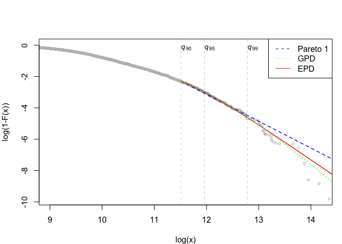

Pareto models for Top Incomes
================
Arthur Charpentier & Emmanuel Flachaire

# Install the `TopIncome` library

The `TopIncome` library can be installed from *github*,

``` r
library(devtools)
devtools::install_github("freakonometrics/TopIncome")
```

    ## Skipping install of 'TopIncome' from a github remote, the SHA1 (cf248e20) has not changed since last install.
    ##   Use `force = TRUE` to force installation

``` r
library(TopIncome)
```

# Fitting Pareto Models

``` r
n <- 1000
set.seed(123)
x <- repd(n,.5,1,-1)
w <- rgamma(n,10,10)
```

## Pareto 1

The **Pareto type 1** distribution is bounded from below by \(u>0\),
with tail parameter  :
the probability density function ….

``` r
estim <- MLE.pareto1(data=x, weights=w, threshold=1)
estim
```

    ## $alpha
    ## [1] 3.300653
    ## 
    ## $k
    ## [1] 1000

## Generalized Pareto

``` r
estim <- MLE.gpd(data=x, weights=w, threshold=1)
estim$par.ests
```

    ##        xi      beta 
    ## 0.4892361 0.2488107

## Extended Pareto

``` r
EPD(data=x, weights=w)
```

    ## $k
    ## [1] 999
    ## 
    ## $gamma
    ## [1] 0.3737252
    ## 
    ## $kappa
    ## [1] 0.1628108
    ## 
    ## $tau
    ## [1] -3.342535

# Application to Income

``` r
url_1 <- "https://github.com/freakonometrics/TopIncome/raw/master/data_csv/dataframe_yw_1.csv"
df <- read.table(url_1,sep=";",header=TRUE)

  PDxlim <- c(9,14.2)
  ysup <- 5
  top.x <- .25 ; top.y <- .4
  top.xx <- 38 ; top.yy <- .11

data_1  <-  tidy_income(income = df$y, weights = df$w)
Pareto_diagram(data_1)
```

<!-- -->

``` r
T <- Table_Top_Share(data_1, p=.01)
```

Tail index \(\alpha\), for three fited distributions

``` r
T$Mat_alpha
```

    ##          alpha1   alpha2    alpha3
    ## cutoff 0.900000 0.950000  0.990000
    ##        1.713197 1.959476  2.187579
    ## xi     2.920797 3.017690 18.662425
    ##        2.279386 2.343399  4.809314

|           |      90% |      95% |       99% |
| --------- | -------: | -------: | --------: |
| Pareto\_1 | 1.713197 | 1.959476 |  2.187579 |
| GPD       | 2.920797 | 3.017690 | 18.662425 |
| EPD       | 2.279387 | 2.343399 |  4.809314 |

Tail Index

Top share income, for three fited distributions

``` r
T$Mat_index
```

    ##           index1    index2    index3
    ## cutoff 0.9000000 0.9500000 0.9900000
    ##        0.1997239 0.1641696 0.1503932
    ## xi     0.1392083 0.1389045 0.1397348
    ##        0.1479075 0.1453855 0.1390286

|           |      90% |      95% |      99% |
| --------- | -------: | -------: | -------: |
| Pareto\_1 | 19.97239 | 16.41696 | 15.03932 |
| GPD       | 13.92083 | 13.89045 | 13.97348 |
| EPD       | 14.79075 | 14.53855 | 13.90286 |

Top Income Share, in percent (for the top
    1%)

``` r
Top_Income(data_1)
```

    ## Warning in if (tail) {: the condition has length > 1 and only the first
    ## element will be used

<!-- -->
